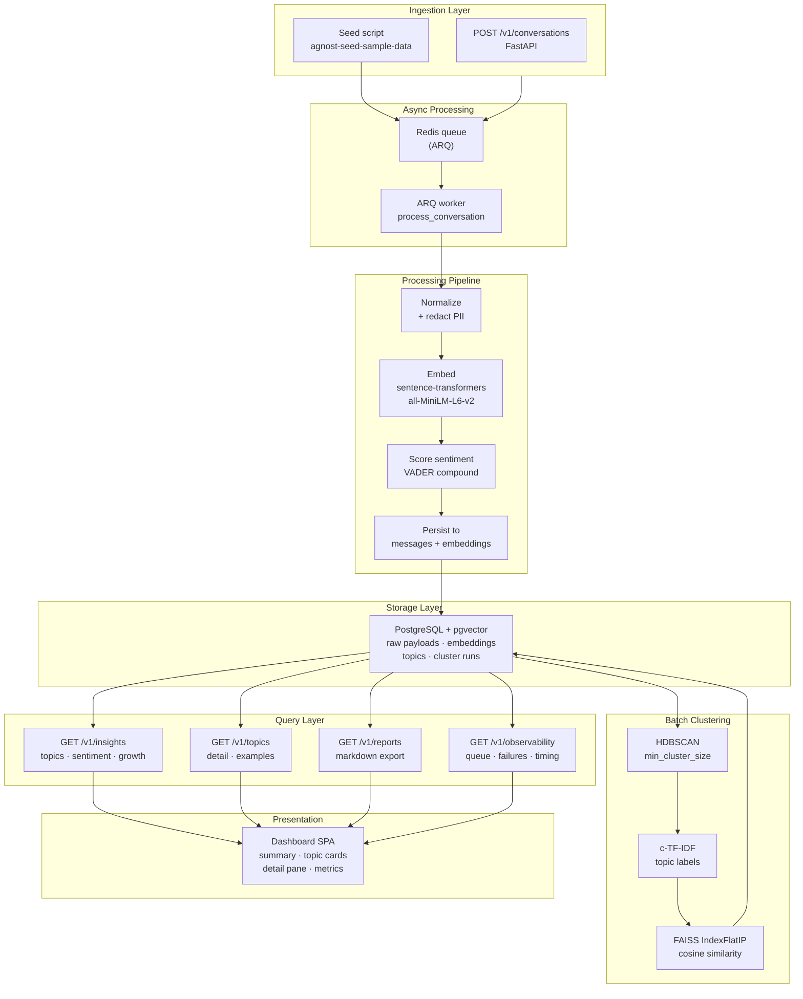
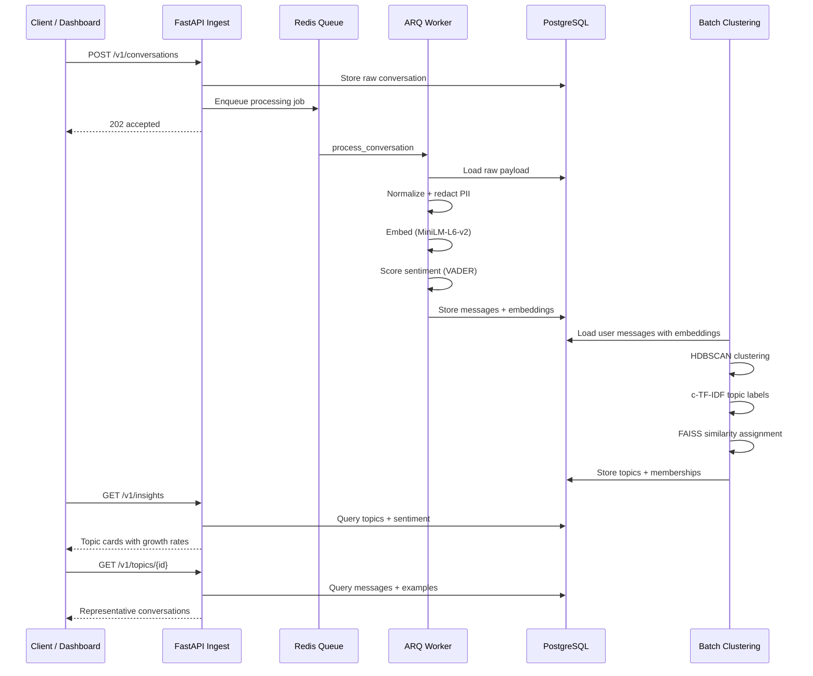
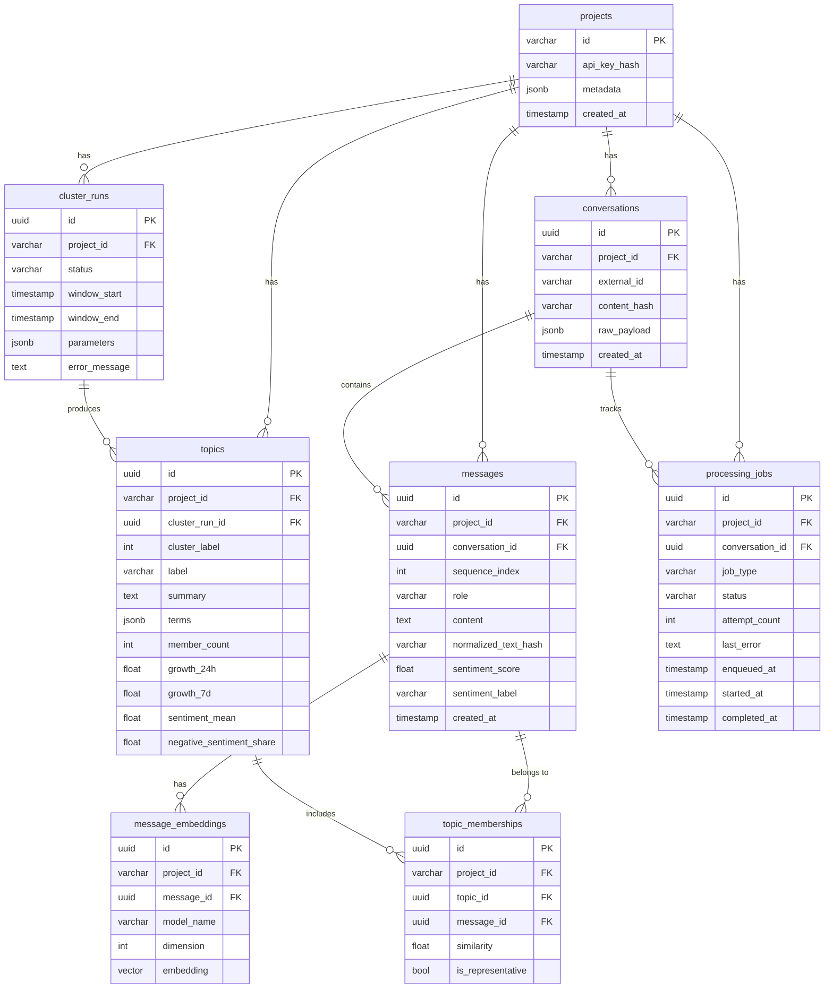

# REASONING

## Summary

Agnost ingests AI-agent conversations, extracts sentiment and semantic embeddings,
clusters recurring user themes, and exposes PM-ready insights — topic labels with
growth rates, sentiment skew, negativity share, and representative message
examples. A single question drives the design: what are users asking for,
complaining about, or repeatedly blocked on right now?

## Architecture

### Data Flow

### Schema

## Major Choices

### PostgreSQL + pgvector

A single database holds raw payloads, derived messages, embedding vectors, topic
assignments, and cluster run metadata. No separate vector store — pgvector indexes
the embeddings in the same transactions as the application data, which keeps
recomputation and inspection straightforward.

**Rejected:** Dedicated vector DBs (Pinecone, Weaviate, Milvus) add operational
overhead without benefit at demo scale. SQLite-only would skip pgvector's IVFFlat
index. The schema uses `Vector(384).with_variant(JSON(), "sqlite")` so integration
tests run against in-memory SQLite while production uses PostgreSQL.

### ARQ for background work

Ingestion returns immediately after enqueueing. Each conversation is processed
asynchronously by an ARQ worker: messages are normalized, obvious PII (email,
phone) is redacted, user-text-only sentiment is scored with VADER, and embeddings
are generated via sentence-transformers/all-MiniLM-L6-v2. Processing jobs track
attempt count, status, timing, and last error. After 3 failed attempts the job is
skipped permanently.

**Rejected:** Celery (too heavy for a demo — broker config, result backends,
flower monitoring). Dramatiq (similar weight to ARQ but less Redis-native).
BackgroundTasks/FastAPI's built-in (no persistence, no retry). ARQ is ~200 lines of
Redis-backed reliability with zero ceremony.

### HDBSCAN with deterministic fallback

HDBSCAN is the primary clustering algorithm because topic counts are unknown and
conversational noise is expected. The fallback path groups messages by
co-occurring significant tokens using a TF-IDF-like bucketing approach — no ML
dependencies required. When numpy and HDBSCAN are available, embeddings are loaded
as float32 arrays and clustered with `min_cluster_size` from configuration. c-TF-IDF
labels topics from the most frequent cluster terms.

**Rejected:** K-means (requires pre-specifying K — impossible for unknown topic
counts). LDA (weaker on short conversational text; needs document-length context).
Agglomerative clustering (O(n²) memory, no native noise handling). The HDBSCAN +
c-TF-IDF combo needs no hyperparameter tuning and naturally separates signal from
noise.

### FAISS spatial index (optional)

When faiss-cpu is installed alongside numpy, `_build_memberships` normalizes all
query embeddings and cluster centroids to unit vectors, builds a `faiss.IndexFlatIP`
(inner product = cosine similarity for normalized vectors), and batch-searches all
message-centroid pairs in one GPU/CPU-optimized call. Without FAISS, similarity is
computed per-message via explicit cosine distance — correct but O(n·k·d).

**Rejected:** scikit-learn's `cosine_similarity` (same O(n·k·d) as the manual
loop, no index acceleration). Annoy/NMSLIB (require building a persistent index;
FAISS in-memory is simpler for batch jobs that rebuild clusters each run).

### Real embeddings and sentiment

The `sentence-transformers/all-MiniLM-L6-v2` model is lazy-loaded at first use.
When the ML extras are not installed, the system falls back to a deterministic
character-sum hash that preserves text identity (identical texts produce identical
vectors). Sentiment uses VADER's compound score with ±0.05 thresholds for
positive/negative classification; the keyword-based stub is preserved as a
fallback.

**Rejected:** OpenAI embeddings API (network latency, cost per call, no offline
demo). Larger sentence-transformers like `all-mpnet-base-v2` (2x memory, marginal
gain on short text). TextBlob for sentiment (slower, same lexicon-based approach
as VADER). Both modules follow the same pattern: try the real model, silently
degrade to the stub if unavailable.

### Raw / derived separation

Raw conversation payloads in the `conversations` table are immutable. All derived
data — `messages`, `message_embeddings`, `topics`, `topic_memberships` — can be
deleted and rebuilt from raw records. The `agnost-recompute` CLI does exactly this:
it wipes derived rows for a project, reprocesses every raw conversation through the
worker, then re-runs clustering. Cluster runs are parameterized and versioned so
different runs can be compared.

### Batch clustering over streaming

Topic discovery does not need request latency. Clustering runs as a batch job,
creating a `ClusterRun` record with window parameters, then replacing previous
topics and memberships atomically. A failed run marks the `ClusterRun` as failed
with an error message and rolls back derived data. Growth rates compare consecutive
equal-length time windows (e.g., most recent 24h vs. prior 24h), returning `None`
when insufficient history exists.

## Reliability

- Ingest dedupes by external ID and normalized content hash.
- Worker jobs track attempt count, status, timing, and last error; max 3 retries.
- Recompute from raw data: `agnost-recompute project-1` rebuilds all derived tables.
- ClusterRun failures are recorded with error messages; previous topics survive.
- Logs carry request IDs and worker timing for traceability.

## Observability

`GET /v1/observability?project_id=...` exposes queue depth, failed job count, and
latest cluster run duration in milliseconds. The dashboard displays these alongside
topic summaries and a live-updating footer.

## Tradeoffs

- **Batch, not streaming.** Topic signals are coarse-grained by design. A PM checks
  weekly trends, not per-second updates. Streaming adds complexity without changing
  the output.
- **No custom model training.** The goal is clarity and reproducibility. Pre-trained
  sentence-transformers and VADER provide strong-enough signals with zero tuning.
- **Dashboard is read-only and single-project.** Hardcoded to `project-1`, no auth.
  Sufficient for the demo reviewer workflow; a production system would add
  project-scoped views and API-key middleware (the schema and dependency skeleton
  already exist).

## Production Path

The repo is a working demo that scales along a clear path:

1. **More data.** pgvector's IVFFlat index handles millions of embeddings. Add
   incremental clustering with topic stability tracking across windows.
2. **Better models.** Swap sentence-transformers for a domain-fine-tuned variant.
   Replace VADER with a transformer-based sentiment classifier.
3. **Multi-tenancy.** The `projects` table supports multiple projects. Add API-key
   middleware (skeleton at `app/api/deps.py`) and per-project dashboards.
4. **Streaming ingestion.** Replace the request/response ingest with a Kafka or
   Redis Streams pipeline for high-throughput production traffic.
5. **Evaluation.** Add held-out topic labeling, inter-annotator agreement metrics,
   and drift detection to quantify cluster quality over time.

Every design choice supports one outcome: a reviewer can see real engineering
judgment, clear architecture tradeoffs, and a product that turns messy
conversations into decision-ready signals.
